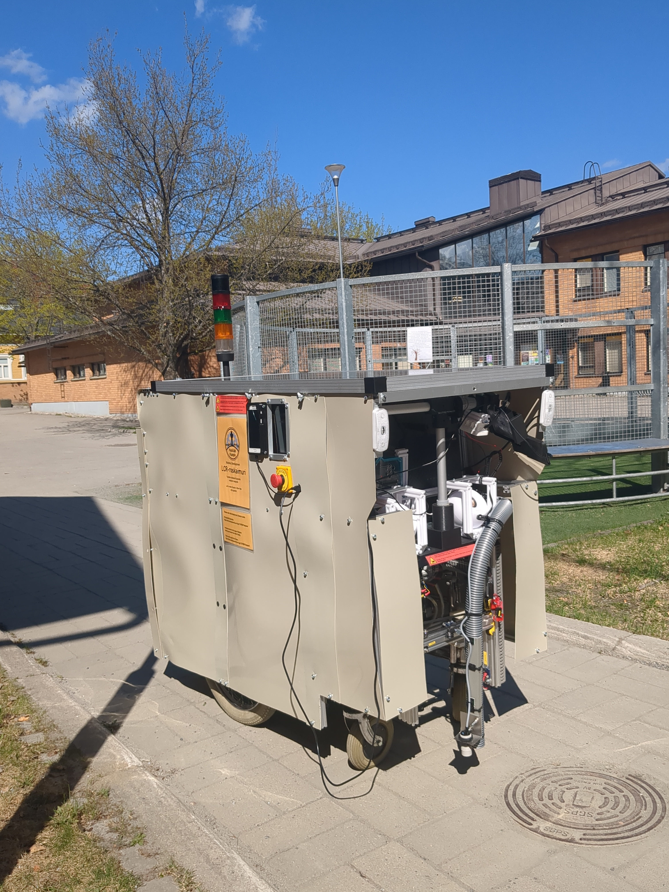
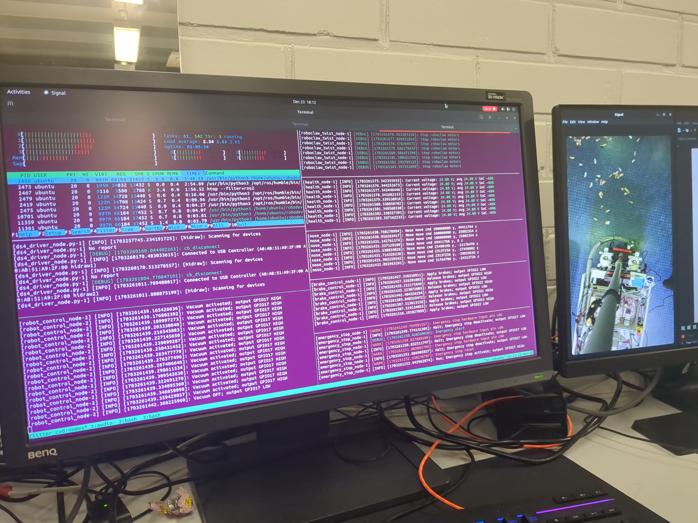
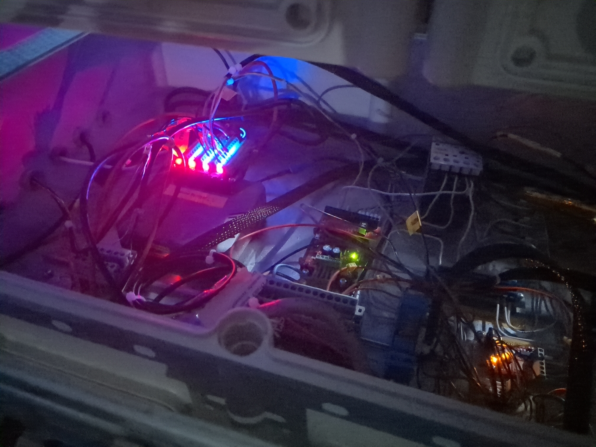

# Litter Collector Robot (LCR)

A remote-controlled outdoor robot that drives around and vacuums up litter,
built on [ROS 2](https://docs.ros.org/en/humble/) and controlled with a
PS4 controller. This repository contains the robot's control software —
the code that runs on the Raspberry Pi inside the robot.

<p align="center">
  
</p>

The Litter Collector Robot (LCR) is a small ground vehicle that a human
drives with a standard PS4 controller. It has a drive base (two motors
via a Roboclaw motor controller), a vacuum unit for picking up litter, a
motorized nozzle that can be aimed independently of the robot's
direction, status lights, and an audio feedback system that plays sounds
for things like low battery, mode changes, and emergency stop. A
Raspberry Pi running Ubuntu and ROS 2 ties all of this together.

It was built as a hands-on hardware/software project combining
robotics, embedded Linux, and off-the-shelf remote-control hardware.

> **Status:** this is a working prototype, developed and driven in the
> real world, but the project is being open-sourced as software only.
> There are currently no CAD files, wiring schematics, or a bill of
> materials included — see [What's included](#whats-included) below.

---

## What's included

This repository contains:
- The full ROS 2 application (Python) that runs on the robot
- Launch files, configuration, and systemd services for running it as
  an appliance that starts at boot
- A development workflow using `tmux`/`tmuxinator` for running and
  observing all the robot's subsystems at once

This repository does **not** currently include:
- CAD models or a bill of materials for the physical robot
- Wiring schematics for the GPIO connections, relays, or motor
  controller (see [Hardware](#hardware) for a rough description of
  what's connected)
- A step-by-step physical build guide
- `roboclaw_3.py`, the RoboClaw Python interface — see
  [RoboClaw motor controller](#roboclaw-motor-controller) below for why,
  and how to get it yourself

If you build your own version, expect to adapt the GPIO pin mapping in
`config/raspberry_gpio.yaml`, and the RoboClaw motor configuration in
`config/roboclaw.yaml`, to your own wiring and hardware.

## Features

- Drive control via a PS4 controller
- Vacuum unit activation/deactivation from the controller
- An independently aimable vacuum nozzle ("the nose")
- Braking and an emergency stop system
- Status lights with color states and turn signals
- Two-stage audio feedback (see [Startup and audio](#startup-and-audio) below)
- Health/telemetry monitoring, with persistent logs
- Runs as a systemd service, so the robot boots directly into a
  ready-to-drive state, headless (no monitor/keyboard needed)

---

## Understanding the software: ROS 2 nodes and the tmux dashboard

You don't need prior Linux terminal experience to follow this section —
it explains the two ideas that make the rest of the README make sense.

**ROS 2 nodes.** The robot's software isn't one program — it's about a
dozen small, independent programs ("nodes"), each responsible for one
job: one drives the motors, one runs the vacuum, one plays sounds, one
watches the battery, and so on. They talk to each other over named
message channels ("topics"), the way departments in an organization
communicate over shared channels rather than one person doing
everything. This makes each part easier to reason about, test, and
replace on its own.

**`tmux` — a terminal multiplexer.** Normally, one terminal window shows
the output of one running program. `tmux` lets you split a single
terminal window into many small panes, each running and displaying a
different program at once — like several small windows tiled inside
one, instead of you having to open, arrange, and manage a dozen separate
windows yourself. Since the LCR has about a dozen nodes running
simultaneously, this gives you one screen where you can see all of them
at a glance.

The genuinely useful property, though, is that a `tmux` session keeps
running in the background even after you disconnect. You can start it,
close your laptop, walk away, come back later, reconnect over SSH, and
"re-attach" to the exact same session — nothing that was running was
interrupted. That's why this setup suits a Raspberry Pi so well: the
robot boots up, starts its own `tmux` session automatically (via
`systemd`, see below), and keeps running whether or not anyone is
watching. You can SSH in from a laptop at any point, run `tmux attach`,
watch everything live, then detach (`Ctrl-b` `d`) and disconnect —
the robot keeps driving.

<p align="center">
  
</p>


### The dashboard layout

The `tmuxinator` configuration lays out two `tmux` windows. This is the
order and grouping you'll see when you attach:

**Window 1 — core robot systems**

| Pane | Node / program | What it shows |
|---|---|---|
| status | `htop` (filtered to ROS processes) | Live CPU/process view of the ROS nodes |
| robot_control | `robot_control_node` | Top-level control logic, PS4 input → robot behavior |
| vacuum | `vacuum_node` | Vacuum unit on/off state |
| health | `health_node` | Battery voltage, estimated charge, temperatures (see [Telemetry & health](#telemetry--health-monitoring)) |
| roboclaw | `roboclaw_twist_node` | Motor commands sent to the Roboclaw controller |
| nose | `nose_node` | Nozzle positioner ("the nose", see below) |
| emergency_stop | `emergency_stop_node` | Emergency stop state |

**Window 2 — input, feedback, and diagnostics**

| Pane | Node / program | What it shows |
|---|---|---|
| ds4_driver | `ds4_driver` | Raw PS4 controller connection and input |
| lights | `lights_node` | Status light tower and turn signals |
| topics | `ros2 topic list` (refreshed periodically) | All active ROS topics, for debugging |
| audio | `audio_node` | Sound effect playback |
| brake | `brake_control_node` | Braking behavior |

---

## Software architecture — node details

- **`robot_control_node`** — reads PS4 controller input and translates
  it into robot behavior; the coordination point for the other nodes.
  Also triggers the `unit_online` sound once the robot is fully up
  (see [Startup and audio](#startup-and-audio)).
- **`roboclaw_twist_node`** — converts velocity commands into signals
  for the Roboclaw motor controller driving the wheels (see
  [RoboClaw motor controller](#roboclaw-motor-controller) below).
- **`roboclaw_error_logger`** — a static helper class that decodes the
  Roboclaw's hex error codes (per the Roboclaw manual's error code
  table) into human-readable messages for the logs.
- **`brake_control_node`** — handles braking.
- **`vacuum_node`** — turns the vacuum unit on/off and tracks session
  stats (runtime, on/off cycle count) used by `health_node`.
- **`nose_node`** — controls "the nose": a repurposed 3D-printer
  extruder-head positioning mechanism (cogwheels and rubber-band belts
  driven by small motors) that aims the vacuum hose independently,
  under PS4 control, talking to its motor drivers over I2C. End-stop
  detectors halt the motors when the mechanism reaches its physical
  minimum/maximum travel, preventing it from driving into its own
  frame.
  *(TODO: `config/main.yaml` configures this node with `i2c_z_address`
  and `i2c_y_address` — worth confirming and standardizing the axis
  naming (X/Y vs. Y/Z) between the code, config, and README so they
  all describe the same two axes consistently.)*
- **`emergency_stop_node`** — monitors for an emergency-stop condition
  (manually triggered, or automatically — see
  [Known issues](#known-issues-and-quirks)) and halts the drive motors.
- **`lights_node`** — controls a light tower mounted on top of the
  robot with green, yellow, red, and white states, an indicator
  buzzer, a flood light, and left/right turn-signal lights.
- **`audio_node`** — plays sound effects (see
  [Startup and audio](#startup-and-audio)) in response to state changes
  across the other nodes, using the
  [`playsound`](https://pypi.org/project/playsound/) Python package.
- **`health_node`** — battery, temperature, and usage telemetry; see
  [Telemetry & health monitoring](#telemetry--health-monitoring).
- **`shutdown_node`** — handles graceful shutdown, with a configurable
  timeout (`shutdown_timeout_sec` in `config/main.yaml`) before forcing
  it.

---

## Hardware

The robot as built uses:
- Raspberry Pi 4 or 5 (see [Known issues](#known-issues-and-quirks) for
  a Pi 5–specific caveat), running Ubuntu 24.04
- A Roboclaw motor controller for the drive motors
- GPIO-connected relays for the vacuum unit and other peripherals
- A repurposed 3D-printer extruder-head mechanism for aiming the vacuum
  nozzle, driven over I2C (see `nose_node` above)
- A light tower and turn-signal lights
- A PS4 (DualShock 4) controller, connected over Bluetooth

<p align="center">
  <!-- photo of the Pi and GPIO wiring inside the robot enclosure -->
  
</p>

Exact GPIO pin assignments live in `config/raspberry_gpio.yaml` — treat
this as a starting point for your own build rather than a spec, since
we don't have formal schematics to publish yet.

### RoboClaw motor controller

Drive motor control goes through a [RoboClaw](https://www.basicmicro.com/RoboClaw)
motor controller, talked to over serial via `config/roboclaw.yaml`. A
few things to know if you're adapting this to your own robot:

- **`wheel_radius` and `wheel_separation`** must be measured from your
  own robot and set in `config/roboclaw.yaml` — these are physical
  properties of your specific wheelbase, not something that can be
  copied from ours.
- **PID tuning** (`m1_p`/`m1_i`/`m1_d`, `m2_p`/`m2_i`/`m2_d`) and the
  quadrature-pulse values (`m1_qpps`, `m2_qpps`, `quad_pulses_per_meter`,
  `quad_pulses_per_revolution`) are specific to our motors/encoders and
  will need re-tuning for different hardware — RoboClaw's own tools
  (Motion Studio) are the standard way to determine these values for a
  given motor/encoder pair.
- **`device_name: "/dev/roboclaw"`** assumes a stable device path,
  which on a fresh system will more likely enumerate as `/dev/ttyACM0`
  or similar.
  **TODO: add a udev rule for a stable `/dev/roboclaw` symlink and
  document it here** — until then, users should either create their
  own rule or point `device_name` at whatever device their RoboClaw
  actually enumerates as.
- **`m1_max_current` / `m2_max_current`** are safety cutoffs — a motor
  is stopped if it draws more current than this, so this should match
  your actual motor's rated current, not ours.

**This repository does not include `roboclaw_3.py`.** It originates
from BasicMicro's own
[`roboclaw_python_library`](https://github.com/basicmicro/roboclaw_python_library/blob/master/roboclaw_python/roboclaw_3.py),
and rather than vendor a third party's file into this codebase (with
the licensing questions that raises), download it yourself and place
it in the package's Python source directory:

```bash
curl -o litter_collector_robot/litter_collector_robot/roboclaw_3.py \
  https://raw.githubusercontent.com/basicmicro/roboclaw_python_library/master/roboclaw_python/roboclaw_3.py
```

**TODO: migrate away from this file entirely** in favor of the
[`roboclaw-python`](https://pypi.org/project/roboclaw-python/) PyPI
package (or the [`basicmicro`](https://pypi.org/project/basicmicro/)
package), which would turn this into a normal pip dependency instead
of a manually-downloaded file. Good candidate for a first external
contribution.

---

## Requirements

- Ubuntu 24.04
- [ROS 2 Humble Hawksbill](https://docs.ros.org/en/humble/)
- Python 3 and pip
- `git`, `tmux`, `tmuxinator`
- [`ds4drv`](https://github.com/naoki-mizuno/ds4drv) (kernel-level PS4
  controller driver) and
  [`ds4_driver`](https://github.com/HacklabKuopio/ds4_driver) (ROS 2
  driver, our patched fork)

## Installation

This is a from-scratch setup for a fresh Debian/Ubuntu machine (either
your development PC or the Raspberry Pi target).

### 1. Install ROS 2 Humble

Follow the [official ROS 2 Humble install instructions](https://docs.ros.org/en/humble/Installation/Ubuntu-Install-Debs.html)
for your OS — the steps below are the common-case summary, but check
the official docs for anything that's changed:

```bash
sudo apt update && sudo apt install -y curl gnupg lsb-release
sudo curl -sSL https://raw.githubusercontent.com/ros/rosdistro/master/ros.key \
  -o /usr/share/keyrings/ros-archive-keyring.gpg
echo "deb [arch=$(dpkg --print-architecture) signed-by=/usr/share/keyrings/ros-archive-keyring.gpg] \
  http://packages.ros.org/ros2/ubuntu $(. /etc/os-release && echo $UBUNTU_CODENAME) main" | \
  sudo tee /etc/apt/sources.list.d/ros2.list > /dev/null

sudo apt update
sudo apt install -y ros-humble-desktop python3-colcon-common-extensions
```

### 2. Install base tooling

```bash
sudo apt install -y python3 python3-pip python3-venv git tmux tmuxinator
```

### 3. Create a virtual environment and install Python dependencies

```bash
python3 -m venv --system-site-packages ~/litter_collector_robot_venv
source ~/litter_collector_robot_venv/bin/activate
pip install -r requirements.txt
```

The `--system-site-packages` flag matters here: `rclpy` and the rest of
the ROS Python stack live in the system Python's site-packages, not in
PyPI, so a normal isolated venv would make `rclpy` unimportable inside
it. This flag lets the venv see the system packages while still
isolating the packages in `requirements.txt`.

Add the activation to `~/.bashrc` so it's active in every new shell
(including the one systemd/tmuxinator launches on the robot):

```bash
# Litter Collector Robot Python environment
source ~/litter_collector_robot_venv/bin/activate
```

### 4. Install the PS4 controller driver (`ds4drv`)

`ds4drv` handles the OS/kernel side of recognizing the PS4 controller,
including the `udev` rules that let a non-root user read from it.
Install and configure it by following the instructions in the
[`ds4drv` repository](https://github.com/naoki-mizuno/ds4drv) —
specifically its udev rules setup, which is required for the ROS driver
below to see the controller at all.

### 5. Add your user to the `dialout` group

Serial devices (including the RoboClaw motor controller) are only
accessible to users in the `dialout` group by default:

```bash
sudo usermod -a -G dialout $USER
```

Log out and back in (or reboot) for this to take effect.

### 6. Get `roboclaw_3.py`

See [RoboClaw motor controller](#roboclaw-motor-controller) above —
this file isn't included in the repo and needs to be downloaded
separately before building.

### 7. Clone and build the ROS workspaces

All ROS packages are cloned into `/opt/robodev/` — the project's
default configs and launch files assume this exact path:

```bash
sudo mkdir -p /opt/robodev
sudo chown "$USER" /opt/robodev
cd /opt/robodev

git clone https://github.com/naoki-mizuno/ds4drv.git
git clone https://github.com/HacklabKuopio/ds4_driver.git
git clone <this-repo-url> litter_collector_robot

cd /opt/robodev/ds4_driver && colcon build --symlink-install
cd /opt/robodev/litter_collector_robot && colcon build --symlink-install
```

*(`ds4drv` itself isn't a ROS package, so it isn't built with `colcon`
— follow its own repository's instructions for installing it.)*

### 8. Set up ROS environment variables

Add the following to `~/.bashrc` (in addition to the venv activation
from step 3) so every new terminal, and the systemd service on the
robot, picks up ROS and this project's packages automatically:

```bash
# ROS setup
source /opt/ros/humble/setup.bash # point this to your humble/setup
source /opt/robodev/ds4_driver/install/local_setup.bash
source /opt/robodev/litter_collector_robot/install/local_setup.bash
export ROS_DOMAIN_ID=10
```

`ROS_DOMAIN_ID` scopes ROS 2's network discovery so nodes only find
others using the same ID — useful if more than one ROS system (e.g. a
second robot, or your dev PC also running ROS) might be on the same
network and you don't want them cross-talking. `10` is this project's
convention; change it if it collides with something else on your
network, but keep it consistent across every machine that needs to
talk to the same robot.

**TODO: review `$PS1` (shell prompt) setting on the robot's Raspberry Pi**

Reload your shell (`source ~/.bashrc` or open a new terminal) before
continuing.

The included `Makefile` wraps the common commands from here on:

| Command | What it does |
|---|---|
| `make build` | `colcon build --symlink-install` |
| `make clean` | Removes `build/` and `install/` |
| `make dev` | Starts all nodes in the development `tmux` layout |
| `make systemd` | Installs and enables the systemd services — **run this on the robot, not your dev PC** (see below) |
| `make start` / `make prod` | Starts the production `tmux` layout manually (normally done by systemd) |
| `make stop` | Stops the production `tmux` session |
| `make main_launch` | Runs just the main launch file directly, without tmux — useful for quick debugging |

---

## Development vs. deployment: two machines, one workflow

This project is typically developed on a regular Linux PC and deployed
to the Raspberry Pi inside the robot — you don't need to edit code
directly on the Pi. A common workflow:

1. Write and test code on your development PC (the install steps above
   work the same there — a full ROS 2 desktop install lets you run and
   debug nodes without the physical robot attached).
2. Push/copy changes to the Raspberry Pi (`git pull`, or `rsync` if
   you're working from an unpushed branch).
3. Build on the Pi (`colcon build`) and run there, since that's where
   the actual GPIO hardware, motor controller, and sensors are — code
   that only touches ROS topics can be exercised on your PC, but
   anything hitting real GPIO pins needs the Pi.
4. Once satisfied, install the systemd services **on the Pi only** (see
   below) so the robot starts this software automatically at boot.

## Running

### Development

From the package directory, start all nodes in a tmux session:

```bash
cd litter_collector_robot
tmuxinator start
# or
make dev
```

Basic `tmux` navigation, once attached:
- `Ctrl-b` then an arrow key — move between panes
- `Ctrl-b` then hold and press an arrow key — resize a pane
- `Ctrl-b` then `d` — detach (leaves everything running in the background)
- `Ctrl-b` then `&` then `y` — close all windows

See the [`tmux` manual](https://github.com/tmux/tmux/wiki) for more.

### Production — on the robot itself only

> ⚠️ This step installs system services that start the robot software
> automatically at boot. Only run it **on the Raspberry Pi inside the
> robot** — not on your development PC, which has no attached hardware
> for this software to control.

On the Raspberry Pi:

```bash
cd litter_collector_robot
sudo make systemd
```

This installs and enables two systemd services (see
[Startup and audio](#startup-and-audio) for what each does), so the
robot starts this software on every boot from then on, with no monitor
or keyboard needed.

To start the main service immediately without rebooting:

```bash
systemctl start litter_collector_robot
```

To watch what's running from your laptop, SSH into the robot and
attach to its `tmux` session:

```bash
ssh <robot-hostname>
tmux attach
```

Detach with `Ctrl-b` `d` when done — this disconnects your view without
stopping the robot.

---

## Startup services

Two separate systemd services are involved in getting the robot ready
to drive, and audio plays at two distinct points for two distinct
reasons:

1. **`lcr-startup-sound.service`** runs immediately at boot, before the
   (comparatively slow) ROS 2 stack has finished starting up. It plays
   a startup sound directly, independent of ROS or `audio_node` — this
   exists purely to give you an audible "the Pi is alive and booting"
   signal within seconds of power-on, well before the robot is
   actually able to move or respond to input.
2. **`litter_collector_robot.service`** brings up the full ROS 2 stack
   (all the nodes described above). Once it's fully initialized,
   `robot_control_node` triggers the `unit_online` sound (played
   through `audio_node`) — this is your actual "the robot is now ready
   to drive" signal, distinct from and later than the boot chime.

If you only ever hear the first sound and never the second, that's a
useful diagnostic: it means the Pi booted but the ROS stack failed to
come up (worth checking `tmux attach` or the systemd journal for
`litter_collector_robot.service`).

---

## Known issues and quirks

- **Raspberry Pi 5 Bluetooth reliability.** Tested on a Raspberry Pi 5
  (8GB). The PS4 controller connects and works wirelessly, but the
  Pi's onboard Bluetooth has been observed to drop the connection
  after a period of use, leaving the robot briefly without control
  input. When this happens, `emergency_stop_node` detects the lost
  controller and halts the drive motors automatically as a safety
  fallback — you'll hear a distinct sound (`control_device_disconnected.wav`
  or an emergency-stop cue, depending on which condition triggered)
  rather than the robot continuing to drive blind. Reconnecting the
  controller restores control. A USB Bluetooth adapter may be more
  reliable than the Pi 5's built-in radio for this use case, but this
  hasn't been formally tested here — contributions welcome.

---

## Telemetry & health monitoring

`health_node` continuously tracks the robot's electrical and mechanical
condition and logs it to two files on the Pi:

- **`~/LCR_odom`** — a single running total of distance travelled, in
  meters, as plain text. The Roboclaw's own encoder counters reset to
  zero whenever it loses power, so this file is how the robot
  remembers its lifetime mileage across power cycles: the last saved
  total is read back in at startup and added to new movement as an
  offset.
- **`~/LCR_health_YYYY-MM-DD.csv`** — one row roughly every 60 seconds,
  with: timestamp, average battery voltage, estimated state of charge
  (%), cumulative vacuum runtime, vacuum on/off cycle count, distance
  travelled this session, lifetime distance travelled, and both
  Roboclaw motor temperatures.

**What it currently does with battery data:** voltage readings are
smoothed over a rolling window of the last 30 samples, then compared
against a configured set of voltage thresholds (`soc_steps` in
`config/main.yaml`, e.g. `21.0`–`25.2` V mapped to 0–100% in 10% steps)
to estimate charge level. Configurable `charging_voltage`,
`yellow_alert_voltage`, and `red_alert_voltage` thresholds (also in
`config/main.yaml`) drive audio + topic alerts, with a cooldown so the
warning sound doesn't repeat every cycle.

**Limitations, and what could be added for a more accurate picture:**

- Voltage-based state of charge is inherently approximate — it's
  reading open-circuit-style voltage while the robot may be actively
  drawing current (driving, vacuuming), and voltage sags under load
  independent of actual remaining charge. The `currents` topic
  `health_node` already subscribes to could be used to either sample
  voltage only during idle moments, or to correct for load-induced sag.
- A more accurate SoC method is **coulomb counting** — integrating
  current draw over time to track amp-hours consumed, rather than
  inferring charge from voltage alone. The current data needed for this
  is already flowing into the node; it isn't accumulated over time yet.
- **Battery State of Health (aging/capacity fade)** isn't tracked at
  all currently, but the existing CSV log is a solid foundation for it:
  since distance travelled, vacuum runtime, and voltage are already
  logged with timestamps, comparing "how far the robot could go per
  charge" across months would reveal capacity fade over the battery's
  life.
- Voltage sag under a known, momentary current draw is also a rough
  proxy for **increasing internal resistance** — another classic aging
  signal — and could be sampled deliberately rather than incidentally.
- Battery **temperature** isn't currently logged (only the two Roboclaw
  motor driver temperatures are) — if the battery pack has its own
  sensor, logging it alongside voltage would improve both safety
  margins and SoC accuracy, since voltage-to-charge curves shift with
  temperature.

---

## Configuration

Robot-specific settings live under `config/`:
- `main.yaml` — top-level configuration: shutdown timeout, drive
  velocity scaling, battery voltage/SoC thresholds, and nose I2C bus
  settings
- `raspberry_gpio.yaml` — GPIO pin assignments for the vacuum, brake,
  emergency stop, and lights (see the note under
  [Hardware](#hardware) about the comment/value mismatches to fix)
- `roboclaw.yaml` — motor controller configuration (see
  [RoboClaw motor controller](#roboclaw-motor-controller) above)
- `audio.yaml` — audio node configuration

## Safety

This is hobbyist/prototype hardware involving moving motors and a
vacuum unit. There is no warranty of any kind. If you build or operate
a robot based on this software, you do so at your own risk.

## Audio attribution

Sound effects used for robot feedback are sourced from
[freesound.org](https://freesound.org) under Creative Commons licenses,
with a small number edited by the project. Full attribution is in
[`ATTRIBUTION.md`](./ATTRIBUTION.md).

## License

This project is licensed under the Apache License 2.0 except where otherwise noted. The file `litter_collector_robot/audio_node.py` is derived from ROS2_audio_player and remains licensed under the Mozilla Public License 2.0.

See [`LICENSE`](./LICENSE) for the full text.

## Acknowledgements

This project was developed as a Hacklab Kuopio project with support from FUUG-säätiö. The LCR team is grateful for the help.
